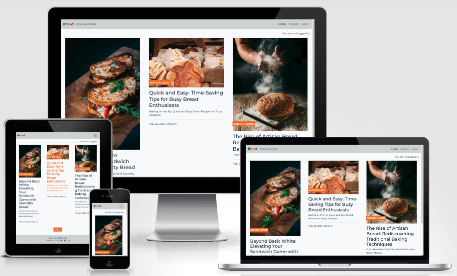
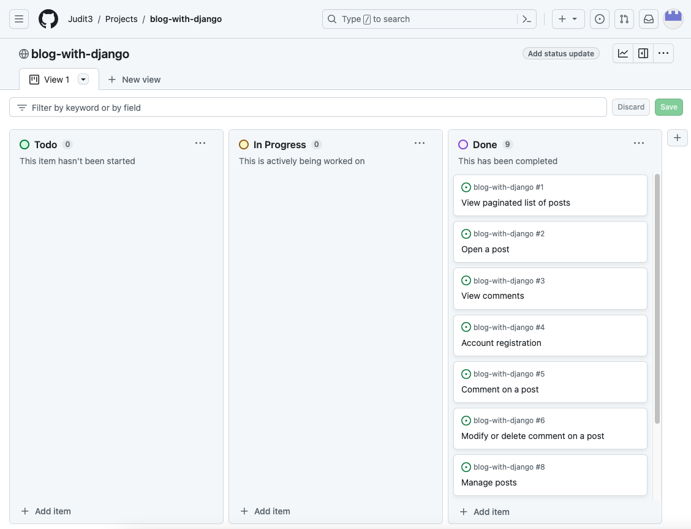

# Bread

Bread is a blog website. Users can explore diverse post about bread, share their thoughts through comments and engage with the community by liking or unliking posts.

Bread is powered by Python, using a Django web framework. The user interface is crafted using Boostrap CSS and JavaScript. Furthermore, Bread is deployed on Heroku, a cloud platform.

You can check out the [live-site.](https://blog-with-django-ju-bff470dd15f2.herokuapp.com/)

## Content

- [Technologies Used](#technologies-used)
  * [Languages Used](#languages-used)
  * [Frameworks, Libraries & Programs Used](#frameworks-libraries--programs-used)
- [User Experience and Workflow](#user-experience-and-workflow)
  * [Target Audience](#target-audience)
  * [Epics](#epics)
  * [User stories](#user-stories)
    + [Workflow](#workflow)
- [Design](#design)
  * [Wireframes](#wireframes)
    + [Timeline](#timeline)
    + [Profile](#profile)
- [Features](#features)
  * [Existing Features](#existing-features)
    + [Navigation Bar](#navigation-bar)
      - [Visitors](#visitors)
      - [Signed-In Users](#signed-in-users)
      - [Admins](#admins)
    + [User Account:](#user-account)
      - [User Sign up](#user-sign-up)
      - [User Login](#user-login)
      - [User Logout](#user-logout)
      - [change Password](#change-password)
      - [Reset Password, through mail](#reset-password-through-mail)
      - [Delete User Account](#delete-user-account)
      - [Access Settings](#access-settings)
    + [Profile:](#profile)
      - [Profile Picture and Bio](#profile-picture-and-bio)
      - [User Content Display](#user-content-display)
      - [Vote Collection](#vote-collection)
    + [Threads, Comments, Votes:](#threads-comments-votes)
      - [Create Threads](#create-threads)
      - [Create Comments](#create-comments)
      - [Upvote and Downvote](#upvote-and-downvote)
      - [Edit Threads](#edit-threads)
      - [Edit Comments](#edit-comments)
      - [Delete Threads and Comments](#delete-threads-and-comments)
      - [Change or Delete Votes](#change-or-delete-votes)
    + [Tags:](#tags)
      - [Tag Site](#tag-site)
      - [Follow Tags](#follow-tags)
      - [Unfollow Tags](#unfollow-tags)
      - [Overview over all tags you follow](#overview-over-all-tags-you-follow)
    + [Global and Tag-based Timeline:](#global-and-tag-based-timeline)
      - [Global Timeline](#global-timeline)
      - [Personalized Tag Timeline](#personalized-tag-timeline)
      - [Pagination](#pagination)
    + [Messages](#messages)
    + [Django Admin Panel](#django-admin-panel)
    + [Info Page](#info-page)
  * [Features Left to Implement](#features-left-to-implement)
    + [Moderation:](#moderation)
    + [Dark Mode:](#dark-mode)
  * [Accessibility](#accessibility)
    + [Fonts](#fonts)
    + [Colors](#colors)
- [Data](#data)
  * [Database schema](#database-schema)
- [Security](#security)
- [Testing](#testing)
    + [Lighthouse Test](#lighthouse-test)
    + [Jigsaw CSS Validator](#jigsaw-css-validator)
    + [W3C Validator](#w3c-validator)
    + [JS Hint Validator](#js-hint-validator)
    + [Accessibility](#accessibility-1)
    + [PEP8](#pep8)
  * [Manual Testing](#manual-testing)
  * [Automatic Testing](#automatic-testing)
  * [Fixed Bugs](#fixed-bugs)
    + [Cascading Deletes for Votes](#cascading-deletes-for-votes)
      - [The Situation:](#the-situation)
      - [The Problem:](#the-problem)
      - [The Solution:](#the-solution)
    + [Default Pictures get deleted](#default-pictures-get-deleted)
      - [The Situation:](#the-situation-1)
      - [The Problem:](#the-problem-1)
      - [The Solution:](#the-solution-1)
- [Deployment](#deployment)
  * [Local Development](#local-development)
    + [How to Clone](#how-to-clone)
    + [How to Fork](#how-to-fork)
  * [Deploy locally](#deploy-locally)
    + [Usage](#usage)
  * [Deployment Using Heroku](#deployment-using-heroku)
- [Credits](#credits)

## Technologies Used

**GitHub** – storage and deployment
**Gitpod** - Editor
**Heroku** - Deployment
**Cloudinary** - Cloud storage for static images
**ElephantSQL** - PostgreSQL database
**Google Fonts** – import font
**Font Awesome**- import social media and contact icons
**Favicon Generator Website** – convert logo
<!-- **Balsamiq** – wireframes design -->
**Am I Responsive?** – check responsiveness of the website
**Google Maps** – embed map location
**Google Chrome** - build and test the website

### Languages Used

Python, HTML/CSS, JavaScript

### Frameworks, Libraries & Programs Used

* Git / Github
* Bootstrap
<!-- * [django-allauth](https://docs.allauth.org/en/latest/)
* [django-crispy-forms](https://django-crispy-forms.readthedocs.io/en/latest/)
* [pillow Imaging Library](https://pypi.org/project/pillow/)
* [django-taggit](https://github.com/jazzband/django-taggit)
* [markdown2](https://pypi.org/project/django-markdown2/)
* [django-image-uploader-widget](https://pypi.org/project/django-image-uploader-widget/)
* django-storages and boto3, for r2 bucket storage
* [django-cleanup](https://github.com/un1t/django-cleanup)
* django extensions for exporting DB schema -->

## User Experience and Workflow

### Target Audience

The Bread Blog caters to bread enthusiasts, foodies, home bakers, and anyone with a passion for all things doughy and delicious. Its target audience are seasoned bakers looking for new recipes, a bread lovers eager to explore different types of loaves, or simply someone who appreciates the comforting aroma of freshly baked bread. The community can discover mouthwatering posts, engage with fellow bread aficionados through comments, and indulge in the simple pleasure of a perfectly baked loaf.

### User stories
Features in this project are structured through [user stories](https://github.com/Judit3/blog-with-django/issues).
Each User Story contains:
- **User Objective:** This field outlines the user's goal or objective. It should clearly state what the user wants to achieve or accomplish. The format follows: "As a user, I want to [action], so that [reason or benefit]." With this Objective in mind, User Stories are created to align with the target audience.
- **Acceptance Criteria:** This field specifies the conditions or criteria that must be met for the user story to be considered complete. It helps define the boundaries and expectations for implementing the user story.

#### Workflow
In the development process, a Kanban board in form of a [github project](https://github.com/users/Judit3/projects/3) is used to manage the tasks and track their progress. Initially, all issues are collected and placed in the Todo section.

When working on the tasks begins, the status of the issues is updated to 'In Process'. This signifies that active development is underway. Once the development work is completed, it is considered 'Done' and is moved to the final column on the Kanban board.

## Design
It was used as inspiration the CodeInstitute blog created with Django as it was found user friendly.

These concepts were presented to other people for feedback and evaluation. Their insights and preferences were carefully considered for each design. Its warm colors and easy flair resonated with the audience.

<!--  -->

