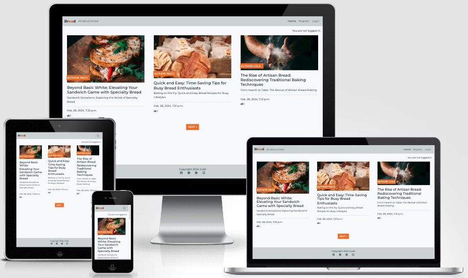
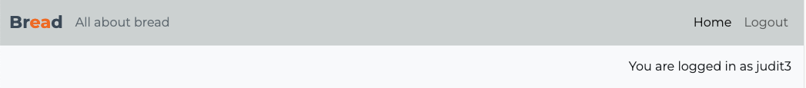
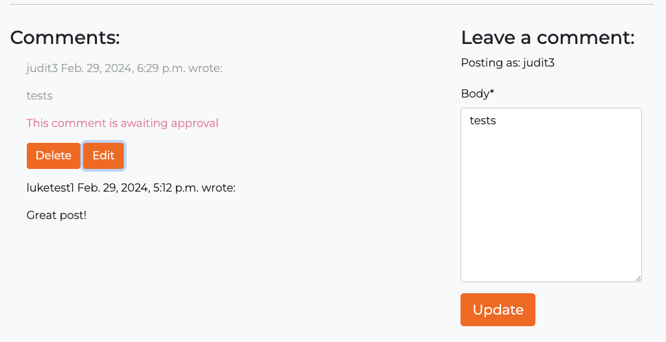
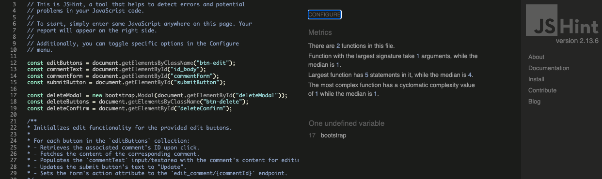

# Bread

Bread is a blog website. Users can explore diverse post about bread, share their thoughts through comments and engage with the community by liking or unliking posts.

Bread is powered by Python, using a Django web framework. The user interface is crafted using Boostrap CSS and JavaScript. Furthermore, Bread is deployed on Heroku, a cloud platform.

You can check out the [live-site.](https://blog-with-django-ju-bff470dd15f2.herokuapp.com/)

---

## Content

- [User Experience and Workflow](#user-experience-and-workflow)
  * [Target Audience](#target-audience)
  * [User stories](#user-stories)
    + [Workflow](#workflow)
- [Design](#design)
  *  [Colour scheme](#colour-scheme)
  *  [Typography](#typography)
  *  [Imagery](#imagery)
  *  [Wireframes](#wireframes)
    + [Home](#home)
    + [Register](#register)
    + [Login](#login)
  * [Features](#features)
    + [Navigation bar in header](#navigation-bar-in-header)
    + [Social media icons in footer](#social-media-icons-in-footer)
    + [Home page](#home-page)
    + [Register page](#register-page)
    + [Login page](#login-page)
    + [Posts](#posts)
    + [Comments](#comments)
    + [Messages](#messages)
    + [Admin panel](#admin-panel)
    + [Future implementations](#future-implementations)
    + [Accessibility](#accessibility) 
- [Technologies Used](#technologies-used)
  * [Languages Used](#languages-used)
  * [Frameworks and Libraries Used](#frameworks-libraries-used) 
- [Deployment](#deployment)
    * [Local development](#local-development)
      - [How to clone](#how-to-clone)
      - [How to fork](#how-to-fork)
    * [Deployment Using Heroku](#deployment-using-heroku)

  - [Testing](#testing)
    - [CSS validation](#css-validation)
    - [HTML validation](#html-validation)
    - [JavaScript validation](#javascript-validation)
    - [Python validation](#python-validation)
    - [Performance](#performance)
    - [Accessibility](#accessibility-1)
    - [Manual testing](#manual-testing)
  - [Bugs](#bugs)
  - [Credits](#credits)
    - [Code used](#code-used)
    - [Content](#content)
    - [Media](#media)
    - [Acknowledgments](#acknowledgments)

---

## User Experience and Workflow

### Target Audience

The Bread Blog caters to bread enthusiasts, foodies, home bakers, and anyone with a passion for all things doughy and delicious. Its target audience are seasoned bakers looking for new recipes, a bread lovers eager to explore different types of loaves, or simply someone who appreciates the comforting aroma of freshly baked bread. The community can discover mouthwatering posts, engage with fellow bread aficionados through comments, and indulge in the simple pleasure of a perfectly baked loaf.

### User stories
Features in this project are structured through [user stories](https://github.com/Judit3/blog-with-django/issues).
Each User Story contains:
- **User Objective:** This field outlines the user's goal or objective. It should clearly state what the user wants to achieve or accomplish. The format follows: "As a user, I want to [action], so that [reason or benefit]." With this Objective in mind, User Stories are created to align with the target audience.
- **Acceptance Criteria:** This field specifies the conditions or criteria that must be met for the user story to be considered complete. It helps define the boundaries and expectations for implementing the user story.

#### Workflow
In the development process, a Kanban board in form of a [github project](https://github.com/users/Judit3/projects/3) is used to manage the tasks and track their progress. Initially, all issues are collected and placed in the Todo section.

When working on the tasks begins, the status of the issues is updated to 'In Process'. This signifies that active development is underway. Once the development work is completed, it is considered 'Done' and is moved to the final column on the Kanban board.

---

## Design
It was used as inspiration the CodeInstitute blog created with Django as it was found user friendly.

These concepts were presented to other people for feedback and evaluation. Their insights and preferences were carefully considered for each design. Its warm colors and easy flair resonated with the audience.

### Colour scheme

 

The website uses a palette of colours that are fitting the colour palette of the Bread website images. The colour palette was created using the [Coolors](https://coolors.co/) website.

### Typography

Google Fonts was used for the Montserrat, it is used for the entire site. It is a sans-serif font. It was chosen as it looked clean and modern.

### Imagery

The blog images were taken from [Unsplash](https://unsplash.com). I have credited these in the [Credits](#Credits) section.
All images were compressed through [Fotor foto editor](https://www.fotor.com) and some formats were changed using [Convertio](https://convertio.co)
Chosen images are by random artists and were picked solely based on the style of the business product.

### Wireframes

#### Home

### Features

#### Navigation bar in header

This website is comprised of three pages, all of them are accessible from the navigation menu. The full responsive navigation bar includes links from the name of the web (Bread) to the Home page, and links to each of the three pages, Home, Register and Login, and is identical in each page to allow for easy navigation.

The navigation bar is located in the upper right corner and for smaller screens it is responsive becoming a hamburger menu. 

This section will allow the user to easily navigate from page to page across all devices without having to revert back to the previous page via the ‘back’ button. 

The inactive page names are faded while the active page name is regular to allow easy understanding of where the user is within the website.

The nav bar addapts if user is logged in or not.

Desktop nav bar:

- Not logged in

- Logged in

- Mobile hamburger nav bar

#### Social media icons in footer 

The website includes four social media icons for Facebook, X, Instagram and Youtube. The icons were sourced from [Fontawasome](https://fontawesome.com/) and their colour was changed to fit the colour palette of the website.
  

#### Home page

The home page has a grey background, it presents the posts grouped in three per window. It is used pagination to allow the navigation through the home page, giving the visitor an idea of what they are going to find in the website.

It is set up using Bootstrap cards with three cards per row and three cards per window.

#### Register page

The register page allows users to create a profile to be able to interact whit the posts.
The user accounts are managed by the AllAuth Django package. After registration all their information is stored in the database. 

#### Login page

Registered users can log in to their accounts using their credentials. The login page allows users to login to interact with the posts, via comments and/or likes/unlikes, once they are registered.

Logged in users can log out of the site by clicking the logout link in the navigation bar. The log out needs to be confirmed.

#### Posts

Once the user click on one post of the home page, the page hosting the post is open, it shows the post image, the post content, the like/unlike icon, a counter of comments icon and a section to write and show users commets.

#### Comments

Users can comment the posts, through the comment field. The comments need to be approved by the admin to be shown in the website, otherwise just the user who did the comment can see it in fade color with a "waiting for approval" text under it.

Comments can be voted by the users and the count of the votes per post is displayed in the post page.

Comments can be edited and deleted. Confirmation is required before deletion. Messages are launched when a post is edited or deleted.

#### Messages

The users are notified about changes on the platform through the django message system.

#### Admin panel

Inside the Django Admin panel, Administrators have acces to the models of the django project.

#### Future implementations

In futere versions of this website it is planned to provide ways for the users to comunicate directly with the website owner, a user profile page will be implemented where users will be able to create posts, add posts to favourites, change their access password, delete their account, to provide a more complete experience.

Overall performance of the website can be improved as some parts of the site are slowing it down. Unfortunately, this type of addition required more technical knowledge.

#### Accessibility

Alt-labels are used for images. Aria-labels for screen readers are implemented at certain places, also semantic elements are used so the page is easy to navigate.

---

## Technologies Used

- **GitHub** – storage and deployment
- **Gitpod** - Editor
- **Heroku** - Deployment
- **Cloudinary** - Cloud storage for static images
- **ElephantSQL** - PostgreSQL database
- **Google Fonts** – import font
- **Font Awesome**- import social media and contact icons
- **Favicon Generator Website** – convert logo
- **Balsamiq** – wireframes design
- **Am I Responsive?** – check responsiveness of the website
- **Google Maps** – embed map location
- **Google Chrome** - build and test the website

### Languages Used

- Python
- HTML/CSS
- JavaScript

### Frameworks and Libraries Used

* Github
* Bootstrap
* Django-allauth
* Django-crispy-forms
* Django-summernote

---

## Deployment

### Local Development

#### How to Clone

1. Click the code button and copy the link of your preferred clone option.
2. Open the terminal in your code editor and change the current working directory to the location you want to use for the cloned directory.
3. Type 'git clone' into the terminal, paste the link you copied in step 1 and press enter.

More detailed steps are provided by github: [github guide to clone a repository](https://docs.github.com/en/repositories/creating-and-managing-repositories/cloning-a-repository)

#### How to Fork

To fork the repository:

1. Log in (or sign up) to Github.
2. Go to the repository for this project.
3. Click the Fork button in the top right corner.

### Deployment Using Heroku

1. Register for an account on Heroku or sign in.
2. Create a new app.
3. Name your App.
5. Connect your github repository to Heroku app.
6. Create a Live Database by adding the postgreSQL add-on.
7. Create a Cloudinary Account.
8. Create and Set up an email account for verification mails.
9. Set Config Vars for your cloudinary (*CLOUDINARY_URL*), database (*DATABASE_URL*) and email(*EMAIL_HOST_PASSWORD*).
10. Deploy from "deploy", or choose an automatic deploy option.

---

## Testing

### CSS validation

- The CSS style.css stylesheet passed through [W3C CSS Validation Service](https://jigsaw.w3.org/css-validator/) with no errors returned.

### HTML validation

- The HTML pages passed through the [W3 Nu HTML Checker](https://validator.w3.org/nu/) with no errors returned.

 

### JavaScript validation

- The JS file was ran through [JS Hint Linter](https://jshint.com/) and no errors were found.

### Python validation

- All Python files were passed through the [CI Python Linter](https://pep8ci.herokuapp.com/) and no errors were foundst of the files.

Nevertheless, a cuople of files showed the warning "line too long", which is not affecting the performance of the page.

### Performance

Website performance was checked with Lighthouse tool.

### Accessibility

To check accessibility the Wave Web Accessibility Evaluation tool was used. No errors were detected. It mentions some contrast issues which are judged not critical by the author.

### Manual testing
To ensure the functionality of the site on top of the written tests: All main features are tested manually.

| Feature | Expected Outcome | Testing Performed | Result | Pass/Fail |
| --- | --- | --- | --- | --- |
| `Navbar` |
||  |  |  |  |  |
| Bread Title | When clicked the user will be redirected to the Home page. | Clicked Title | Redirected to the Home page. | Pass |
| Home Page Link | When clicked the user will be redirected to the Home page.| Clicked link | Redirected to the Home page. | Pass |
| Login Page Link | When clicked the user will be redirected to the login page. | Clicked link | Redirected to the login page. | Pass |
| Register Page Link | When clicked the user will be redirected to the Register page. | Clicked link | Redirected to the Register page. | Pass |
| Log out Page Link | When clicked the user will be redirected to the confirmation of log out page and confirmed to the Home page. | Clicked link | Redirected to the log out page and when confirmed to the Home page | Pass |
| --- | --- | --- | --- | --- |
| `Main` |
|  |  |  |  |  |
| Next and Prev Buttons | Next brings to next window, prev brings to previous | Press Nex and Prev buttons | Next brought to next window, previous brought to previous list of blog posts | Pass |
| Full blog post display | On click of blog title in blog list full blog display | Click on the link of the post in the Home page | Full blog post is displayed |
| Leaving a Comment | Logged in Users can leave a comment under a post. | Opening a post window. Filling out the comment form. submit the form. | The comment gets displayed under the post. | Pass |
| Like Post | After pressing the thumb up under the post, the likes count should move 1 up and the user is notified about their action | Pressing the thumb. | The like counts +1. and the user is notified about their action | Pass |
| Removing a like on a post. | By pressing on the thumb of an already liked post, the like count should be removed, down-counting the like counts by 1 and the user is notified about their action | Press the like button again. | The like count is removed. Downcountin the likes count by 1 and the user is notified about their action. | Pass |
| Messages when user interacts with the webpage | A message is displayed on the top of page under the headerat can be removed manually by the user | Signup, Log in, leave a comment, like/unlike a post | A message is displayed on the top of page under the headerat can be removed manually by the user | Pass |
| Sign Up | When the User is signing up with valid credentials, an account should be created. After Signing up, the User is logged in. | Signing up with username = test, email = test@test.es,  password = Secure123! | The User is logged in. An Account has been created. | Pass |
| Invalid Sign Up | When the User is signing in with invalid credentials, they get informed about the invalid data. | Signing up with email = cc and password = 123 | The User gets informed about an invalid email and password. | Pass |
| Login | Can login in with the correct password and username. | Login with username = test,  password = Secure123! | User is logged in. | Pass |
| Invalid Login | Users can't login with invalid credentials. | Login with username = test, password = aSecure123! | The user is not logged in. | Pass |
| Logout | After Confirming to logout, the user gets logged out. | Pressing Button to confirm the logout. | User is logged out. | Pass |
| --- | --- | --- | --- | --- |
| `Footer` |
|  |  |  |  |  |
| Social Media Icons | When clicked the user will be redirected to the appropriate social media pages in a new window. | Clicked icon | Redirected to the social media page in a new window. | Pass |
| --- | --- | --- | --- | --- |

Following devices and browsers were used:

Laptop:

* Macbook Pro 

Mobile Devices:

* iPhone SE
  
Browsers:

* Google Chrome
* Safari

---

## Bugs

No bugs were detected.

---

## Credits

### Code used

The code was mostly taken from the Blog Project Challenge of CodeInstitute and modified.

### Content

Content was partially written and created by the developer with inspiration from other Codeinstitute student projects.

### Media

Images were downloaded from royalty free website unsplash.com (<https://www.unsplash.com>).

  
### Acknowledgments

My mentor Luke for continuous support and helpful feedback.
